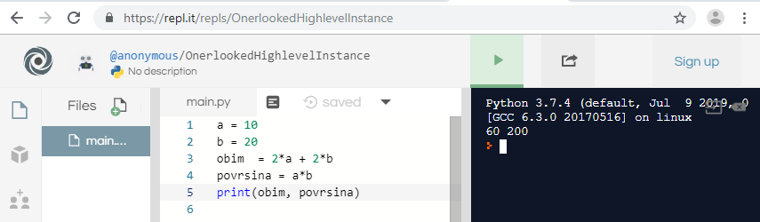

Pajton programi
===============

Kao što smo videli u poglavlju o Karelu, programi se sastoje od naredbi. Pogledajmo neke od osnovnih naredbi u Pajtonu, koje ćemo koristiti za pisanje prvih programa.

Dodeljivanje vrednosti promenljivoj
-----------------------------------

Promenljive su imenovani prostor u memoriji računara, u koji možemo da smestimo vrednost bilo koje vrste (broj, tekst, logičku vrednost ili nešto drugo). U promenljive često smeštamo međurezultate (pomoćne rezultate) pri računanju. Kada pokrenemo Pajton školjku, možemo jednom naredbom da dodelimo vrednost nekoj promenljivoj, a zatim da koristimo vrednost te promenljive u narednim komandama. Na primer:

.. code::

    >>> osnova = 6*8
    >>> osnova
    48
    >>> osnova * 1.5
    72.0
    >>> osnova * 1.6
    76.80000000000001

.. infonote::

    **Naredba dodeljivanja vrednosti**

    Naredba dodeljivanja vrednosti se piše tako što napišemo ime promenljive, zatim znak jednakosti, a onda izraz čiju vrednost dodeljujemo promenljivoj. Cele i realne brojeve takođe smatramo za izraze (to su najjednostavniji mogući izrazi).

.. infonote::

    **Imena promenljivih**
    
    Prema pravilima pisanja programa, imena promenljivih (kao i druga imena u programima koje pišemo) mogu da se sastoje od malih i velikih slova, donje crte i cifara, s tim da ne mogu da počnu cifrom.
    
    Pajton pravi razliku između malih i velikih slova. *N* i *n* su različita imena i ako bismo oba koristili, ona bi predstavljala dve različite promenljive.
    
    Ime promenljive može biti dugačko koliko nam je potrebno.
    
    Pri pisanju programa (ili pojedinačnih naredbi) se trudimo da promenljivama damo smislena imena, da bi naredbe i programi bili što jasniji.

U pajtonu je uobičajen stil da se velika slova ne koriste (iako su dozvoljena), a kada se ime sastoji od više reči, te reči se razdvajaju donjom crtom, na primer *cena_jednog_komada*. Cifre se u imenima koriste kada to ima smisla (što nije često). 

**Imena promenljivih - proverite razumevanje:**

.. dragndrop:: console__basics_quiz_variable_names
    :feedback: Pokušajte ponovo!
    :match_1: 2_datum ||| neispravno, počinje nedozvoljenim znakom
    :match_2: ljubimac_br_2 ||| ispravno ime
    :match_3: stanje_u_23:59 ||| neispravno, sadrži nedozvoljeni znak

    Uparite predložena imena promenljivih sa odgovorima.

.. mchoice:: console__basics_quiz_name
   :multiple_answers:
   :answer_a: pRoMeNlJiVa
   :answer_b: a1
   :answer_c: 2D_grafika
   :answer_d: _3D_grafika
   :answer_e: ljubimac-br-2 
   :correct: a, b, d

   Šta sve od navedenog može da bude ime promenljive?

Ispisivanje vrednosti iz programa
---------------------------------

Pri interaktivnom radu je dovoljno da unesemo izraz da bismo videli njegovu vrednost, ali iz programa ne možemo da koristimo takav način. Da bismo nešto ispisali iz programa, koristimo funkciju *print()*. Za sada ćemo se ograničiti na najjednostavnije načine upotrebe ove funkcije.

Izraz čiju vrednost želimo da ispišemo, navodimo između zagrada, na primer:

.. code::

    >>> print(2 + 2)
    4
    >>> 

Jednim pozivom Funkcije *print()* možemo da ispišemo i više vrednosti. Izraze čije vrednosti želimo da ispišemo, navodimo između zagrada razdvojene zarezima, na primer:

.. code::

    >>> a = 10
    >>> b = 20
    >>> obim  = 2*a + 2*b
    >>> povrsina = a*b
    >>> print(obim, povrsina)
    60 200
    >>> 

.. infonote::

    Sa funkcijama smo se već sretali u poglavljima o Karelu, prepoznajemo ih po zagradama iza imena. Podsetimo se, podatke koje navodimo između zagrada nazivamo parametri ili argumenti funkcije. O funkcijama ćemo uskoro pričati opširnije.

Pokretanje programa
-------------------

**Pokretanje programa iz brauzera**

Da bismo vam olakšali početak učenja, koristeći **ActiveCode** tehnologiju  projekta `Runestone Interactive <http://runestoneinteractive.org/>`__ , omogućili smo vam da pokrećete Pajton programe u veb stranama ovog kursa. Na primer, ispod se nalaze  naredbe koje smo prethodno unosili interaktivno, ali ovaj put napisane kao program. Program možete da pokrenete klikom na dugme "Pokreni program".

.. activecode:: console__program_first

    a = 10
    b = 20
    obim  = 2*a + 2*b
    povrsina = a*b
    print(obim, povrsina)

**Pokretanje programa iz okruženja IDLE**

Preporučujemo vam da pored pisanja programa u ovim veb stranicama barem povremeno pokrećete programe i u *IDLE* okruženju. Navikavanje na okruženje *IDLE* je važno da biste postali samostalniji u programiranju.

Kada pokrenete program *IDLE*, otvorite integrisani editor teksta (meni *File / New File*) i u njemu otkucajte prethodni (ili neki drugi) program. 

Kada završite program, sačuvajte ga (meni *File / Save*), a zatim ga pokrenite (meni *Run / Run Module*).

.. image:: ../../_images/Console/console_run_from_idle.png
  :width: 350px
  :align: center

Rezultat ćete videti u prozoru interaktivne školjke.

**Pokretanje programa iz onlajn okruženja**

Još jedan način da pokrenete svoj Pajton program je da koristite neko od onlajn okruženja za programiranje. Jedno takvo okruženje je https://repl.it/ .

.. image:: ../../_images/Console/console_repl.it_start.png
  :width: 500px
  :align: center

Kliknite na dugme ``+ new repl``, odaberite jezik Pajton (Python) i kliknite ``Create repl``. U vašem veb brauzeru će se otvoriti strana u kojoj možete da otkucate program i da ga pokrenete.

Greške u programima
-------------------

Ponekada će se dešavati da neku naredbu u programu ne otkucate tačno po pravilima pisanja naredbi na jeziku Pajton. U takvom slučaju Pajton interpreter ne može da razume naredbu i dobijate poruku o grešci. Svako okruženje za izvršavanje programa prijavljuje grešku na nešto drugačiji način, ali svako od njih kaže u kojoj liniji programa je došlo do greške i o kojoj vrsti greške se radi.

Pojava grešaka ne treba da vas brine, jer je to uobičajena stvar i dešava se i iskusnim programerima. Pažljivo pogledajte poruku, potrudite se da razumete šta je pogrešno, zatim to ispravite i pokrenite program ponovo. Razumevanje poruka o greškama je sastavni deo programiranja i može da se uvežba se kao i mnoge druge veštine.

Da biste lakše razumeli poruke o greškama koje ćete dobijati (a i da biste se oslobodili eventualnog straha od greške), preporučujemo da sada probate namerno da napravite neke male greške, koje bi inače mogle da vam se potkradu pri pisanju programa. 

Kada napravite nekoliko namernih grešaka, naučićete kako izgledaju odgovarajuće poruke o grešci i biće vam lakše da shvatite u čemu je problem kada se te poruke kasnije pojave zbog nenamernih grešaka.

Isprobajte neke greške ovde:

.. activecode:: console__program_make_err

        # dodajte naredbe

Mi smo vam takođe pripremili nekoliko programa sa namerno učinjenim greškama, koje zatim objašnjavamo. Programi su kratki da bi greške bile uočljivije, ali i u dužim programima ispravljanje grešaka je skoro isto. Pošto poruka o grešci sadrži broj linije programa u kojoj se greška nalazi, u dužim programima samo treba prvo naći pomenutu liniju programa i pogledati tu (i eventualno prethodnu) liniju.

Pokrenite svaki od narednih programa, zatim pogledajte poruku o grešci i objašnjenje.

.. activecode:: console__program_err1

    prit(2+2)
    
Poruka kaže da je greška tipa *NameError* (greška imena). To znači da neko od imena u pomenutoj liniji nije poznato Pajton interpreteru (nije definisano). Primećujemo da ime funkcije *print* nije tačno napisano (a funkcija *prit* ne postoji). Ubacivanjem slova *n* greška se ispravlja i program radi.

.. activecode:: console__program_err2

    zbir = 2 + 2
    print(zbirr)
    
Greška je istog tipa, samo se ovaj put odnosi na ime *zbirr*. Uklanjanjem suvišnog slova *r* program postaje ispravan.

.. activecode:: console__program_err3

    a = 3
    b = 2
    print(a b)
    
Greška je tipa *SyntaxError* (sintaksna greška), što znači da nisu poštovana pravila pisanja na Pajtonu. U ovom slučaju nedostaje zarez između *a* i *b*.

.. activecode:: console__program_err4

    a = 3
    b = 2
    print a, b

Još jedna sintaksna greška. Ponovo nisu ispoštovana pravila pisanja, a ovaj put nedostaju zagrade.

.. activecode:: console__program_err5

    a = 3
    b = 0
    print(a / b)

Greška je tipa *ZeroDivisionError* (greška deljenja nulom). Ova greška je drugačija od prethodnih, jer je naredba  pravilno napisana i interpreter ju je rastumačio. Međutim, prilikom izvršvanja ove naredbe došlo je do deljenja nulom, što nije dozvoljena operacija. Program treba pisati tako da ne dolazi do situacije u kojoj se pokušava deljenje nulom. Ispravka u ovom slučaju zavisi od toga šta želimo da naš program radi u ovakvoj siuaciji. Jedna mogućnost je da pre deljenja proverimo da li je delilac jednak nuli.

~~~~

Proverite da li ste razumeli ova tri tipa greške, tako što ćete odgovoriti na pitanje.

.. dragndrop:: console__program_quiz_errors
    :feedback: Pokušajte ponovo!
    :match_1: SyntaxError|||print(3*(2+2)
    :match_2: NameError|||a=3 print(a / b)
    :match_3: ZeroDivisionError|||b=3//6 print(3 // b)

    Upari tip greške sa programom.
