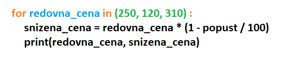

Skripte i *for* petlja
======================

Skripte
-------

Ljudi često u Pajtonu pišu kratke programe koje sami koriste da bi nešto izračunali ili automatizovali. Takvi programi su poznati i pod imenom **skripte.** Za skripte nije neobično da pojedini ili svi ulazni podaci budu sadržani u samoj skripti umesto da se učitavaju. Na primer, sledeća skripta računa cenu sa popustom od 20 odsto:
 
.. activecode:: console__scripting_fixed

    popust = 20
    redovna_cena = 250
    snizena_cena = redovna_cena * (1 - popust / 100)
    print(redovna_cena, snizena_cena)

Uputstvo za korišćenje ove skripte bi moglo da bude: “U prve dve linije skripte postavite vrednosti koje želite i zatim pokrenite skriptu“.

Slično uputstvo nećete videti za programe koje instalirate na svoj računar ili mobilni telefon. Takve programe zovemo **aplikacije**, i oni su pisani tako da korisnici ne moraju da znaju (a najčešće i ne mogu da znaju) kako izgledaju naredbe tog programa.

Kod skripti nema tako striktne podele na korisnike i programere kao kod aplikacija. Skripte se često pišu za sopstvenu upotrebu ili za korisnika koji i sam programira ili razume programiranje. Svi programi u ovom priručniku su zapravo više skripte nego aplikacije.

Već smo naglasili da ovaj priručnik nije namenjen samo budućim profesionalcima u programiranju. I ako ne budete programirali aplikacije, i dalje možete imati koristi od programiranja. Možda ćete napisati neku skriptu ili prilagoditi neku postojeću, kao što je to trebalo učiniti u zamišljenom uputstvu za skriptu iz prethodnog primera.

Ponavljanje računanja za razne podatke
--------------------------------------

Uopštimo prethodni primer. Pretpostavimo da u jednoj prodavnici imamo pravo na popust od 20 odsto u odnosu na istaknute cene. Interesuju nas snižene cene raznih proizvoda, čije redovne cene znamo. Da bismo dobili sve snižene cene koje nas interesuju, potrebno je ponoviti naredbe za računanje snižene cene.

**Više pokretanja programa koji učitava podatke**

Rešenje koje već umemo da napišemo je da program učita redovnu cenu proizvoda a zatim izračuna i ispiše sniženu cenu. Taj program može da izgleda ovako:

.. activecode:: console__scripting_input

    popust = 20
    redovna_cena = int(input())
    snizena_cena = redovna_cena * (1 - popust / 100)
    print(redovna_cena, snizena_cena)

Program možemo da pokrenemo više puta, zadajući svaki put redovnu cenu po jednog od proizvoda koji nas interesuju.

**Višestruki ulazni podaci u samom programu**

U slučaju kada su nam unapred poznate sve redovne cene proizvoda koji nas inteesuju, više pokretanja programa i unošenje jedne po jedne cene nije najudobniji način da dobijemo sve snižene cene. Umesto toga, udobnije bi bilo da sve redovne cene unesemo direktno u program i da za svaki od tih podataka ponovimo računanje i ispisivanje rezultata.

Naredba *for*
-------------

Da bismo mogli da ponovimo neki deo programa za razne podatke, potrebna nam je naredba **for**, koja omogućava  ponavljanje drugih naredbi. Sada ćemo upoznati jedan način korišćenja naredbe *for*, a još neke načine ćemo upoznati tokom narednih lekcija. 

Vratimo se primeru sa popustom. Recimo da su redovne cene proizvoda koji nas interesuju 250, 120 i 310 i želimo da pomoću programa u jednom izvršavanju izračunamo cene sa popustom za te proizvode. To možemo da uradimo ovako:

.. activecode:: console__scripting_for

    popust = 20
    for redovna_cena in (250, 120, 310):
        snizena_cena = redovna_cena * (1 - popust / 100)
        print(redovna_cena, snizena_cena)

Napomena: Zapis oblika (250, 120, 310) se u matematici zove uređena *n*-torka (uređena entorka), ali u programiranju je odomaćeno kraće ime - **torka**.

Pokretanjem programa vidimo da on ispisuje:

.. code::

    250 200.0
    120 96.0
    310 248.0

Primećujemo da su se poslednje dve linije programa izvršile tri puta, pri čemu je promenljiva *redovna_cena* dobijala redom vrednosti 250, 120, 310. To smo postigli naredbom ``for``. Delovi programa koji se ponavljaju se često nazivaju petljama, pa možemo reći da smo u prethodnom primeru upotrebili **for petlju**. 

Na sledećoj slici su označeni glavni elementi ovog oblika *for* petlje: 

- Crvenom bojom su napisani obavezni elementi (reči ``for``, ``in`` i znak dvotačka ``:`` u prvom redu). Ovi elementi se u svakoj *for* naredbi pišu na isti način. 
- Plavom bojom je napisana **promenljiva petlje**. Na tom mestu pišemo ime promenljive koja će uzimati redom navedene vrednosti. U našem primeru promenljiva petlje je *redovna_cena*.
- Zelenom bojom je napisana torka vrednosti. Na tom mestu u zagradama pišemo vrednosti razdvojene zarezima. To su vrednosti koje će redom uzimati promenljiva petlje. U našem primeru torka vrednosti je (250, 120, 310).
- Crnom bojom je napisano **telo petlje**. To su naredbe koje se po jedanput izvršavaju za svaku vrednost promenljive petlje. U naredbama tela petlje može, a ne mora da se koristi promenljiva petlje.

Naredbe tela petlje se pišu uvučeno u odnosu na prvi red naredbe *for* i sve se uvlače za isti broj razmaka. Uobičajeno je da se koristi 4 razmaka za uvlačenje i mi ćemo se držati te preporuke.

Primeri i zadaci
''''''''''''''''

.. questionnote::
    
    **Primer - kada poći**
    
    Dragoljub treba da stigne na odredište najkasnije u 17:00. Zavisno od načina putovanja koji odabere, Dragoljubu može da bude potrebno 55, 70, 85, ili 95 minuta. Napišite program koji za svaki način putovanja ispisuje kada najkasnije Dragoljub treba da pođe da bi na vreme stigao na odredište.
    
Program koji rešava ovaj zadatak, mogao bi da izgleda ovako:

.. activecode:: console__scripting_start_travel
    
    stizanje = 17*60
    for trajanje in (55, 70, 85, 95):
        polazak = stizanje - trajanje
        polazak_sati = polazak // 60
        polazak_minuta = polazak % 60
        print("Ako put traje", trajanje, "minuta, treba krenuti u", polazak_sati, "sati i", polazak_minuta, "minuta.")

.. questionnote::

    **Zadatak - trajanje puta**

    Đorđe namerava da u 9 sati ujutro krene autom na put od 600 kilometara i interesuje ga kada bi stigao na odredište ako bi vozio srednjom brzinom od 90, 100, 120 ili 130 kilometara na sat. Dopunite program koji ispisuje vreme stizanja na odredište za svaku od pomenutih srednjih brzina.
  
.. activecode:: console__scripting_speed

    duzina_puta = 600 # Km
    polazak = 9       # h
    for a in ():  # ispravite i dopunite
        trajanje_puta = duzina_puta / brzina # h
        dolazak = polazak + trajanje_puta    # h
        dolazak_sati = int(dolazak)
        dolazak_minuta = round((dolazak - dolazak_sati) * 60)
        print("Pri brzini", brzina, "dolazak je u", dolazak_sati, "sati i", dolazak_minuta, "minuta")
        
.. commented out

    duzina_puta = 600
    polazak = 9
    for brzina in (90, 100, 120, 130):
        trajanje_puta = duzina_puta / brzina
        dolazak = polazak + trajanje_puta
        dolazak_sati = int(dolazak)
        dolazak_minuta = round((dolazak - dolazak_sati) * 60)
        print("Pri brzini", brzina, "dolazak je u", dolazak_sati, "sati i", dolazak_minuta, "minuta")

.. questionnote::

    **Zadatak - završna ocena**

    Zbir dosadašnjih 5 Pertrovih ocena je 23. Petar očekuje još jednu ocenu sa završnog kontrolnog zadatka. Dopunite program koji za svaku moguću završnu ocenu (1, 2, 3, 4, ili 5) ispisuje kolika bi bila srednja ocena u tom slučaju.
    
  
.. activecode:: console__scripting_final_mark

    zbir_ocena_do_sad = 23
    broj_ocena_do_sad = 5
    for # dopunite
        srednja_ocena = 0 # ispravite
        print("Sa završnom ocenom", zavrsna_ocena, "srednja ocena bi bila", srednja_ocena)

.. questionnote::

    **Zadatak - džeparac**

    Marina pravi plan trošenja džeparca tokom letovanja od 14 dana. Napišite program koji za prosečne dnevne potrošnje od 5, 10 ili 20 evra ispisuje koliko bi u svakom od tih slučajeva Marini ukupno trebalo novca.
    

.. activecode:: console__scripting_allowance

    broj_dana = 14
    # dovršite

