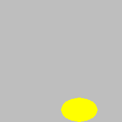

Crtanje pravougaonika, elipsi i krugova
---------------------------------------

Sve funkcije za crtanje u biblioteci PajGejm počinju sa ``pg.draw``. U zavisnosti od toga koji oblik želimo da nacrtamo, pozivamo različite funkcije. U objašnjenjima koja slede, značenje parametara je:

- Parametar *prozor* je prozor na kome crtamo. U ovom priručniku programi će već imati formiranu promenljivu (tačnije objekat) *prozor*, dobijen kao rezultat poziva funkcije ``pg.display.set_mode``.
- Parametar *boja* je boja kojom crtamo. Kao što je ranije rečeno, boja se može zadati imenom (na primer :code:`pg.Color("black")` za crnu) ili kao torka ili lista dužine 3 (na primer :code:`[255, 0, 0]` za crvenu).
- Parametar *pravougaonik* je torka ili lista dužine četiri :math:`(x, y, w, h)` ili :math:`[x, y, w, h]` koja opisuje pravougaonik, kao što je ranije objašnjeno (koordinate gornjeg levog temena, širina i visina pravougaonika).
- Parametar *centar* predstavlja neku tačku. Kao što smo ranije pomenuli, tačka može da se zada kao torka (ili lista) dužine 2, koja predstavlja koordinate tačke u prozoru u kome crtamo.
- Parametar *debljina* je debljina linije kojom crtamo. U funkcijama koje ovde objašnjavamo, ovaj parametar nije obavezan i moguće ga je izostaviti. 

Sada ćemo videti detaljnije opise funkcija za crtanje pravougaonika, elipsi i krugova. Posle svakog opisa funkcije dat je sasvim kratak primer od jedne ili dve linije koda. Svaki od tih primera možete da izvršite kopiranjem u program ispod (koji za sad ne crta ništa). Slike koje prate date primere su tako i dobijene.

.. activecode:: pygame__drawing_primirives_def
    :nocodelens:
    :modaloutput: 

    import pygame as pg, pygamebg
    prozor = pygamebg.open_window(200, 200, "Pygame")

    prozor.fill(pg.Color("gray"))

    pygamebg.wait_loop()

Crtanje pravougaonika
'''''''''''''''''''''

Za crtanje pravougaonika se koristi funkcija ``pg.draw.rect``, koja ima dva oblika:

.. code::

    pg.draw.rect(prozor, boja, pravougaonik, debljina)
    pg.draw.rect(prozor, boja, pravougaonik)

Oblik bez prametra *debljina* koristimo kada želimo da pravougaonik bude ceo obojen navedenom bojom.

Na primer, prvom od sledeće dve naredbe zadajemo:

- crta se pravougaonik (funnkcija je *rect*)
- crnom bojom (parametar (0, 0, 0) znači crnu boju) 
- Gornje levo teme pravougaonika je (40, 80)
- širina pravougaonika je 50 a visina 30 piksela. 
- crta se samo okvir pravougaonika linijom debljine 3 piksela

Značenje druge naredbe je:

- crta se pravougaonik (funnkcija je *rect*)
- crnom bojom (parametar pg.Color("black") takođe znači crnu boju) 
- Gornje levo teme pravougaonika je (140, 80)
- širina i visina pravougaonika su po 20 piksela, pa pošto su jednake dobijamo kvadrat
- Ceo kvadrat će biti popunjen bojom, jer nema parametra za debljinu linije

.. activecode:: pygame__drawing_rectangles_def
    :passivecode: true
    
    pg.draw.rect(prozor, (0, 0, 0), (40, 80, 50, 30), 3)
    pg.draw.rect(prozor, pg.Color("black"), (140, 80, 20, 20))

.. image:: ../../_images/PyGame/drawing_rectangles.png
   :width: 200px   
   :align: center 

Crtanje elipse
''''''''''''''

Za crtanje elipse se koristi funkcija ``pg.draw.ellipse``, sa ili bez prametra koji predstavlja debljinu:

.. code::

    pg.draw.ellipse(prozor, boja, pravougaonik, debljina)
    pg.draw.ellipse(prozor, boja, pravougaonik)

Parametar *pravougaonik* predstavlja pravougaonik u koji je elipsa upisana, a ostali parametri imaju isto značenje kao i ranije. Ako nam je potrebno, centar i poluose elipse možemo da izračunamo na osnovu torke  :math:`(x, y, w, h)` ili liste :math:`[x, y, w, h]` koja zadaje pravougaonik. Koordinate centra pravougaonika, a ujedno i centra elipse su :math:`(x + w/2, y + h/x)`, a poluose elipse su :math:`w/2` i :math:`h/2`. Tako na primer, naredba

.. activecode:: pygame__drawing_ellipse_def
    :passivecode: true

    pg.draw.ellipse(prozor, pg.Color("yellow"), (100, 160, 60, 40))

crta žutu popunjenu elipsu. Centar elipse je centar navedenog pravougaonika, a to je tačka (130, 180). Horizontalna poluosa elipse je dužine 30, a vertikalna dužine 20.

Crtanje kruga
'''''''''''''

Za crtanje kruga se koristi funkcija ``pg.draw.circle``, sa ili bez prametra koji predstavlja debljinu:

.. code::

    pg.draw.circle(prozor, boja, centar, poluprecnik, debljina)
    pg.draw.circle(prozor, boja, centar, poluprecnik)

Parametar *centar* je tačka koja predstavlja centar kruga, a parametar *poluprecnik* je broj koji predstavlja poluprečnik kruga u pikselima. Na primer, sledeća naredba crta kružnu liniju crvene boje, debljine 3 piksela, poluprečnika 50 piksela, sa centrom u tački (100, 100):

.. activecode:: pygame__drawing_circle_def
    :passivecode: true

    pg.draw.circle(prozor, pg.Color("red"), (100, 100), 50, 3)

.. image:: ../../_images/PyGame/drawing_circle.png
   :width: 200px   
   :align: center 

Da je poslednji parametar (debljina linije jednaka 3 piksela) bio izostavljen, krug bi ceo bio obojen crvenom bojom.

Crtanje pravougaonika, elipsi i krugova - pitanja
'''''''''''''''''''''''''''''''''''''''''''''''''

Proverite koliko ste razumeli i zapamtili o ovim funkcijama za crtanje:

.. mchoice:: pygame__drawing_quiz_circle_arglist
   :multiple_answers:
   :answer_a: Koordinate gornjeg levog temena
   :answer_b: Poluprečnik
   :answer_c: Koordinate centra
   :answer_d: Širina i visina
   :answer_e: Boja
   :correct: b, c, e
   :feedback_a: Koordinate gornjeg levog temena se zadaju kod elipse i pravougaonika
   :feedback_b: Tačno
   :feedback_c: Tačno 
   :feedback_d: Širina i visina se zadaju kod elipse i pravougaonika
   :feedback_e: Tačno

   Šta se zadaje prilikom crtanja kruga?

.. mchoice:: pygame__drawing_quiz_circle_right_args
   :answer_a: pg.draw.circle(prozor, boja, 100, 100, 30, 5)
   :answer_b: pg.draw.circle(prozor, boja, (100, 100), 30, 5)
   :answer_c: pg.draw.circle(prozor, boja, (100, 100, 30, 5))
   :answer_d: pg.draw.circle(prozor, boja, (100, 100), (30, 5))
   :correct: b
   :feedback_a: Pokušajte ponovo
   :feedback_b: Tačno
   :feedback_c: Pokušajte ponovo
   :feedback_d: Pokušajte ponovo

   Da bi se nacrtao krug sa centrom u tački :math:`(100, 100)`, poluprečnika :math:`30` piksela, debljine :math:`5` piksela, potrebno je izvršiti poziv funkcije:

.. mchoice:: pygame__drawing_quiz_circle_opt_arg
   :answer_a: u drugom slučaju crta elipsa čije su poluose r i 1.
   :answer_b: u drugom slučaju krug popunjava bojom.
   :answer_c: u prvom slučaju crta krug, a u drugom samo kružna linija - kružnica.
   :answer_d: u prvom slučaju crta samo kružnica, a u drugom krug.
   :correct: c
   :feedback_a: Pokušajte ponovo
   :feedback_b: Pokušajte ponovo
   :feedback_c: Tačno
   :feedback_d: Pokušajte ponovo

   Razlika između `pg.draw.circle(prozor, boja, (cx, cy), r)` i `pg.draw.circle(prozor, boja, (cx, cy), r, 1)` je to što se:

.. mchoice:: pygame__drawing_quiz_rect_args_1
   :answer_a: Koordinate gornjeg levog temena
   :answer_b: Debljina
   :answer_c: Širina
   :answer_d: Visina
   :answer_e: Koordinate centra
   :correct: e
   :feedback_a: Pokušajte ponovo
   :feedback_b: Pokušajte ponovo
   :feedback_c: Pokušajte ponovo
   :feedback_d: Pokušajte ponovo
   :feedback_e: Tačno

   Šta se NE zadaje prilikom crtanja pravougaonika?

.. mchoice:: pygame__drawing_quiz_rect_args_2
   :answer_a: pg.draw.rect(prozor, boja, 100, 100, 30, 50)
   :answer_b: pg.draw.rect(prozor, boja, (100, 100), (30, 50))
   :answer_c: pg.draw.rect(prozor, boja, (100, 100), 30, 50)
   :answer_d: pg.draw.rect(prozor, boja, (100, 100, 30, 50))
   :correct: d
   :feedback_a: Pokušajte ponovo
   :feedback_b: Pokušajte ponovo
   :feedback_c: Pokušajte ponovo
   :feedback_d: Tačno

   Da bi se nacrtao pravougaonik čije je gornje levo teme u tački
   :math:`(100, 100)`, čija je širina :math:`30`, a visina :math:`50`
   piksela, potrebno je izvršiti poziv funkcije:

.. mchoice::  pygame__drawing_quiz_rect_args_3
   :answer_a: pg.draw.rect(prozor, boja, (80, 80, 50, 80))
   :answer_b: pg.draw.rect(prozor, boja, (80, 80), (130, 160))
   :answer_c: pg.draw.rect(prozor, boja, (80, 80, 130, 160))
   :answer_d: pg.draw.rect(prozor, boja, (80, 80), (50, 80))
   :correct: a
   :feedback_a: Tačno
   :feedback_b: Pokušajte ponovo
   :feedback_c: Pokušajte ponovo
   :feedback_d: Pokušajte ponovo

   Da bi se nacrtao pravougaonik čije je gornje levo teme u tački
   :math:`(80, 80)`, a donje desno teme u tački :math:`(130, 160)`,
   potrebno je izvršiti poziv funkcije:

Crteži po uputstvima
''''''''''''''''''''

U sledećim zadacima možete da vidite šta treba da nacrta vaš program tako što kliknete na dugme "Prikaži primer". Da biste mogli da napišete potrebne naredbe, data su i detaljna uputstva sa opisom parametara.

Obratite pažnju na to da pre crtanja treba da obojite pozadinu odgovarajućom bojom, što se postiže naredbom ``prozor.fill(pg.Color(...))`` (na mestu tačkica treba zadati boju).

.. questionnote::

    **Meta:** na beloj pozadini nacrtajte metu pomoću tri koncentrična kruga. Centri sva tri kruga treba da budu u centru prozora i svaki krug treba da je popunjen bojom. Prvo treba nacrtati crveni krug poluprečnika 100, zatim plavi poluprečnika 75 i na kraju zeleni krug poluprečnika 50 piksela.
    
Šta mislite, da li bi ovi krugovi mogli da da budu nacrtani i drugačijim redosledom? Ako niste sigurni šta bi se dogodilo pri promeni redosleda, isprobajte.

.. activecode:: PyGame__drawing_target
   :nocodelens:
   :enablecopy:
   :modaloutput:
   :playtask:
   :includexsrc: src/PyGame/1_Drawing/1_BasicExamples/target.py

.. questionnote::

    **Pače:** na zelenoj pozadini nacrtati pače kao lik iz crtanih filmova. Crtež se sastoji od sledećih delova:
    
    - Glava: žuta popunjena elipsa, upisana u pravougaonik veličine 320 h 300 piksela, kome je gornje levo teme u tački (40, 50)
    - Ivica glave: crna elipsa koja uokviruje prethodnu elipsu linijom debljine 1
    - Levo oko: crna popunjena elipsa, upisana u pravougaonik veličine 40 h 40 piksela, kome je gornje levo teme u tački (130, 130)
    - Desno oko: crna popunjena elipsa, upisana u pravougaonik veličine 40 h 40 piksela, kome je gornje levo teme u tački (280, 120)
    - Usta (kljun): crvena popunjena elipsa, upisana u pravougaonik veličine 120 h 140 piksela, kome je gornje levo teme u tački (200, 170)
    - Ivica usta: crna elipsa koja uokviruje prethodnu elipsu linijom debljine 1

Ovde imamo više slobode u redosledu crtanja, ali neki redosled i dalje treba poštovati. Pokušajte da objasnite koji delovi slike moraju da budu nacrtani baš u ovom redosledu, a koji ne moraju.

Primetite da su oči upisane u pravougaonike koji su ustvari kvadrati. Kako (zahvaljujući tome) drugačije možemo da nacrtamo iste ovakve oči?

.. activecode:: PyGame__drawing_duckling
   :nocodelens:
   :enablecopy:
   :modaloutput:
   :playtask:
   :includexsrc: src/PyGame/1_Drawing/1_BasicExamples/duckling.py

