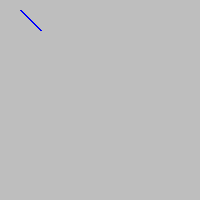

Crtanje pravih linija i mnogouglova
-----------------------------------

Funkcije za crtanje pravih linija i mnogouglova slične su funkcijama za crtanje pravougaonika, elipsi i krugova, koje smo već upoznali. Parametri *prozor*, *boja* i *debljina* se i ovde koriste, i to sa istim značenjem kao i ranije. Nove parametre ćemo objasniti na mestu pojavljivanja.

Ponovićemo i ovde "prazan" program, koji samo rukuje bibliotekom PajGejm i prozorom za crtanje (a sam ne crta ništa), za slučaj da želite nešto da isprobate.

.. activecode:: pygame__drawing_primirives_def_copy
    :nocodelens:
    :modaloutput: 
    :enablecopy:

    # -*- acsection: general-init -*-
    import pygame as pg, pygamebg
    prozor = pygamebg.open_window(200, 200, "Pygame")
    prozor.fill(pg.Color("gray"))
    # -*- acsection: main -*-

    # -*- acsection: after-main -*-
    pygamebg.wait_loop()
 

Crtanje linije
''''''''''''''

Za crtanje linije se koristi funkcija ``pg.draw.line``, sa ili bez prametra koji predstavlja debljinu. 

.. code::

    pg.draw.line(prozor, boja, tacka1, tacka2, debljina)
    pg.draw.line(prozor, boja, tacka1, tacka2)

- Parametri *tacka1*, *tacka2* su tačke na ekranu, koje predstavljaju krajeve duži. Podsetimo se još jednom, tačka se zadaje kao torka ili lista dužine 2. Elementi ove torke ili liste su koordinate tačke u prozoru u kome crtamo.
- Kod ove funkcije izostavljanje debljine ima drugačije značenje nego u ostalim funkcijama, a to je da se koristi podrazumevana debljina linije od 1 piksel.
    
Na primer, naredbom:

.. activecode:: pygame__drawing_line_def
    :passivecode: true

    pg.draw.line(prozor, pg.Color("blue"), (20, 10), (40, 30), 2)
    
iscrtavamo plavu liniju debljine 2 piksela od tačke :math:`(20, 10)` do tačke :math:`(40, 30)`.

Crtanje mnogougla
'''''''''''''''''

Za crtanje mnogougla se koristi funkcija ``pg.draw.polygon``, koja takođe ima dva oblika:

.. code::

    pg.draw.polygon(prozor, boja, lista_tacaka, debljina)
    pg.draw.polygon(prozor, boja, lista_tacaka)

- Parametar *lista_tacaka* predstavlja listu temena mnogougla koji crtamo. Na primer [(50, 250), (150, 150), (250, 250)] predstavlja listu od 3 tačke.
- Ovde ponovo oblik funkcije bez prametra *debljina* koristimo kada želimo da mnogougao bude ceo obojen navedenom bojom (ako navedemo debljinu, crta se mnogugaona linija te debljine). 

Na primer, sledeća naredba crta trougao obojen bojom :math:`(0, 100, 36)`. Temena trougla su :math:`(50, 100)`, :math:`(150, 150)` i :math:`(150, 50)`.

.. activecode:: pygame__drawing_polygon_def
    :passivecode: true

    pg.draw.polygon(prozor, (0, 100, 36), [(50, 100), (150, 150), (150, 50)])

.. image:: ../../_images/PyGame/drawing_polygon.png
   :width: 200px   
   :align: center 

Pored ovih nabrojanih i opisanih funkcija, u modulu ``pg.draw`` postoje i druge funkcije za crtanje, ali se ovde nećemo njima baviti. Ukoliko vas interesuje više o tim funkcijama, kompletnije informacije možete naći na primer na `<https://www.pygame.org/docs/ref/draw.html>`__

Funkcije za crtanje - pitanja
'''''''''''''''''''''''''''''

Proverite koliko znate o funkcijama za crtanje:

.. parsonsprob:: pygame__drawing_quiz_arg_order

   Kojim redom se ovi argumenti zadaju u pozivu funkcije `pg.draw.line`
   -----
   prozor
   boja
   koordinate prvog temena
   koordinate drugog temena
   debljina

.. mchoice:: pygame__drawing_quiz_polygon_args1
   :answer_a: pg.draw.polygon(prozor, boja, [(0, 0), (50, 100), (100, 0)])
   :answer_b: pg.draw.polygon(prozor, boja, (0, 0), (50, 100), (100, 0))
   :answer_c: pg.draw.polygon(prozor, boja, (0, 0, 50, 100, 100, 0))
   :answer_d: pg.draw.polygon(prozor, boja, [0, 0, 50, 100, 100, 0])
   :correct: a
   :feedback_a: Tačno
   :feedback_b: Pokušajte ponovo
   :feedback_c: Pokušajte ponovo
   :feedback_d: Pokušajte ponovo

   Želimo da nacrtamo trougao. U kom obliku mogu da se zadaju koordinate tačaka?

.. mchoice:: pygame__drawing_quiz_polygon_args2
   :multiple_answers:
   :answer_a: pg.draw.polygon(prozor, boja, [(0, 0), (50, 100), (100, 0)], 7)
   :answer_b: pg.draw.polygon(prozor, boja, [(0, 0), (0, 50), (50, 50), (50,  0)])
   :answer_c: pg.draw.polygon(prozor, boja, [(0, 0), (50, 100), (100, 0)])
   :answer_d: pg.draw.polygon(prozor, boja, [(0, 0), (0, 50), (50, 50), (50,  0)], 4)
   :correct: b, c
   :feedback_a: Tačno
   :feedback_b: Pokušajte ponovo
   :feedback_c: Pokušajte ponovo
   :feedback_d: Tačno

   Koji od narednih poligona se ne može nacrtati pomoću više poziva funkcije ``pg.draw.line``?
   
.. dragndrop:: pygame__drawing_quiz_function_names
    :feedback: Pokušajte ponovo!
    :match_1: Duž|||pg.draw.line
    :match_2: Mnogougao|||pg.draw.polygon
    :match_3: Pravougaonik|||pg.draw.rect
    :match_4: Krug|||pg.draw.circle

    Uparite naredbe za crtanje i oblike koji se njima crtaju.
    
.. parsonsprob:: pygame__drawing_quiz_general_arg_order

   Poređajte u skladu sa tipičnim redosledom argumenata u funkcijama za crtanje:
   -----
   prozor
   boja
   koordinate
   debljina

   
.. mchoice:: pygame__drawing_quiz_point_list
   :answer_a: Krug
   :answer_b: Elipsa
   :answer_c: Mnogougao
   :answer_d: Duž
   :answer_e: Kvadrat
   :correct: c
   :feedback_a: Pokušajte ponovo
   :feedback_b: Pokušajte ponovo
   :feedback_c: Tačno
   :feedback_d: Pokušajte ponovo
   :feedback_e: Pokušajte ponovo

   Prilikom crtanja kog od navedenih oblika se koordinate zadaju u obliku liste uređenih parova?

Crteži po uputstvima
''''''''''''''''''''

.. questionnote::

    **Strašilo:** Nacrtajte strašilo na beloj pozadini. Ono se sastoji od sledećih delova:
    
    - glava: crna kružna linija debljine 6, sa centrom u tački (150, 70), poluprečnika 50
    - telo: crna prava linija debljine 6, od tačke (150, 120) do tačke (150, 300)
    - ruke: crna prava linija debljine 6, od tačke (80, 170) do tačke (220, 170)
    - leva noga: crna prava linija debljine 6, od tačke (150, 300) do tačke (90, 480)
    - desna noga: crna prava linija debljine 6, od tačke (150, 300) do tačke (210, 480)

.. activecode:: pygame__drawing_scarecrow
   :nocodelens:
   :enablecopy:
   :modaloutput:
   :playtask:
   :includexsrc: src/PyGame/1_Drawing/1_BasicExamples/scarecrow.py
   
.. questionnote::

    **Jelka:** Nacrtajte jelku na beloj pozadini. Ona se sastoji od sledećih delova:

    - stablo: pravougaonik popunjen bojom (97, 26, 9), veličine 40 h 50, sa gornjim levim temenom u tački (130, 250)
    - gornji deo krošnje: trougao popunjen bojom (0, 100, 36), sa temenima (50, 250), (150, 150) i (250, 250)
    - srednji deo krošnje: trougao popunjen bojom (0, 100, 36), sa temenima (75, 200), (150, 100) i (225, 200)
    - donji deo krošnje: trougao popunjen bojom (0, 100, 36), sa temenima (100, 150), (150, 50) i (200, 150)
    
.. activecode:: pygame__drawing_tree
   :nocodelens:
   :enablecopy:
   :modaloutput:
   :playtask:
   :includexsrc: src/PyGame/1_Drawing/1_BasicExamples/tree.py

Crteži iznenađenja
''''''''''''''''''

Da biste u zadacima koji slede videli crtež, potrebno je da napišete tražene naredbe i pokrenete svoj program.

.. questionnote::

    **iznenađenje 1 - spojite tačke:** Data su temena mnogougla. Nacrtajte na pozadini boje "darkgreen" taj mnogougao, popunjen bojom "khaki".

.. activecode:: pygame__drawing_giraffe
   :nocodelens:
   :enablecopy:
   :modaloutput:
   :includexsrc: src/PyGame/1_Drawing/2_ByInstructions/giraffe.py

.. questionnote::

    **iznenađenje 2:** 
    
    Bojom "limegreen" iscrtajte:
    
    - Punu elipsu koja je upisana u pravougaonik, čije je gornje levo teme (75, 100), širina mu je 150, a visina 180;
    - Liniju debljine 6, od tačke (130, 110) do tačke (120, 20);
    - Još jednu liniju debljine 6, od tačke (170, 110) do tačke (180, 20);
    - Popunjen krug poluprečnika 10 piksela, sa centrom u tački (120, 20);
    - Popunjen krug poluprečnika 10 piksela, sa centrom u tački (180, 20);
    
    Crnom bojom iscrtajte još dve pune elipse, i to:

    - jednu upisanu u pravougaonik čije je gornje levo teme (110, 140), širina mu je 30, a visina 50;
    - drugu upisanu u pravougaonik čije je gornje levo teme (160, 140), širina mu je 30, a visina 50;

.. activecode:: pygame__drawing_ant
   :nocodelens:
   :enablecopy:
   :modaloutput:
   :includexsrc: src/PyGame/1_Drawing/2_ByInstructions/insect.py
   
