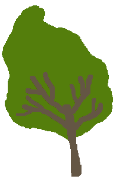

Prikazivanje gotovih slika - zadaci
-----------------------------------

Naučili smo kako da prikažemo gotovu sliku tako da njen gornji levi ugao bude na zadatoj poziciji na ekranu. U nekim situacijama pozicija gornjeg levog ugla slike neće nam biti poznata, nego će biti potrebno da je izračunamo. U takvim slučajevima može da bude potrebno da znamo i širinu i visinu slike. U Pajtonovoj biblioteci PajGejm za sliku ``sl``, širinu i visinu te slike dobijamo redom kao  ``sl.get_width()`` i ``sl.get_height()``.

Korpe
'''''

Dovršite sledeći program, tako da se dobija slika kao u primeru. Pozicije drveća su date, a pored svakog drveta treba nacrtati korpu tako da se donji desni uglovi slike korpe i slike drveta poklapaju.

Da biste mogli da dovršite ovaj zadatak, potrebno je da za svaku nacrtanu korpu izračunate poziciju njenog gornjeg levog ugla, što može da se uradi polazeći od koordinata gornjeg levog ugla drveta, koristeći širine i visine obe slike.

.. image:: ../../_images/apple_small.png
   :width: 50px

.. image:: ../../_images/basket.png
   :width: 50px

.. activecode:: PyGame__pictures_baskets1
    :nocodelens:
    :enablecopy:
    :modaloutput:
    :playtask:
    :includexsrc: src\PyGame\1_Drawing\9_UsingImages\trees_baskets.py

    drvo_slika = pg.image.load("tree.png")  # slika drveta
    korpa_slika = pg.image.load("basket.png")  # slika korpe
    drvece_poz = ((200, 70), (120, 150), (240, 290), (550, 170), (400, 200))

Branje jabuka
'''''''''''''

Dovršite sledeći program, tako da se dobija slika kao u primeru. Rešenje ovog zadatka se dobija dopunjavanjem prethodnog programa, tako da se dodaju jabuke na drveće i u korpe.

.. activecode:: PyGame__pictures_baskets_apples
    :nocodelens:
    :enablecopy:
    :modaloutput:
    :playtask:
    :includexsrc: src\PyGame\1_Drawing\9_UsingImages\trees_apples_baskets.py

    drvo_slika = pg.image.load("tree.png")  # slika drveta
    korpa_slika = pg.image.load("basket.png")  # slika korpe
    jabuka_slika = pg.image.load("apple_small.png")  # slika jabuke
    drvece_poz = ((200, 70), (120, 150), (240, 290), (550, 170), (400, 200))
    jabuke_na_drvetu_poz = ((43,191), (61, 158), (124, 145), (134, 175), (160, 180))
    jabuke_u_korpi_poz = ((15, 38), (60, 41), (22, 43), (49, 45), (34, 48))

Sanduci
'''''''

.. questionnote:: 

    Napišite programe koji koriste sliku jednog sanduka prikazanu ispod,

    .. image:: ../../_images/PyGame/box.png
        :width: 200px
        :align: center 

    i formiraju slike kao u primerima (koristite dugme "Prikaži primer" u svakom od zadataka).
      
    Koordinate slike, to jest njenog gornjeg levog ugla za krajnji levi sanduk su (60, 400), a za najviši sanduk su (420, 115). 

Iz datih podataka i slike mogu da se odrede serije *x* i *y* koordinata slike svakog sanduka u svakom od primera. Ovde dodatno treba voditi računa i o redosledu iscrtavanja slika kutija. 

Da biste bolje razumeli kako ista serija brojeva (na primer 10, 15, 20, 25, 30) može da se dobije u različitim redosledima i na šta pri tome treba obratiti pažnju, odgovorite na pomoćno pitanje.

.. dragndrop:: console__pictures_quiz_series_negative_step
    :feedback: Pokušajte ponovo!
    :match_1: 10, 15, 20, 25, 30 ||| for x in range(10, 35, 5)
    :match_2: 30, 25, 20, 15, 10 ||| for x in range(30, 5, -5)
    :match_3: prazna serija ||| for x in range(30, 10, 5)
    :match_4: 5, 15, 25 ||| for x in range(5, 35, 10)

    Uparite serije brojeva sa naredbama koje ih generišu.

.. activecode:: PyGame__pictures_boxes1
    :nocodelens:
    :enablecopy:
    :modaloutput:
    :playtask:
    :includexsrc: src\PyGame\1_Drawing\9_UsingImages\boxes1.py

.. activecode:: PyGame__pictures_boxes2
    :nocodelens:
    :enablecopy:
    :modaloutput:
    :playtask:
    :includexsrc: src\PyGame\1_Drawing\9_UsingImages\boxes2.py

.. activecode:: PyGame__pictures_boxes3
    :nocodelens:
    :enablecopy:
    :modaloutput:
    :playtask:
    :includexsrc: src\PyGame\1_Drawing\9_UsingImages\boxes3.py

