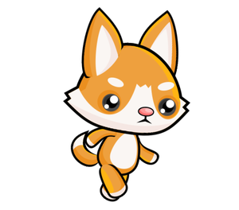

Kako se prave animacije
-----------------------

Jednostavan način da ostvarimo animaciju je da deo programa koji iscrtava jedan frejm smestimo u odvojenu funkciju. Tu funkciju ćemo u programima po pravilu nazivati *nov_frejm*, mada ona može da ima i bilo koje drugo ime. 

Menjanje crteža
'''''''''''''''

Da bismo dobili animaciju, bitno je da funkcija koja crta frejm pri sledećem pozivu pravi crtež koji je nešto drugačiji od prethodnog, jer bez promene nema animacije. Da bi novi crtež mogao da bude drugačiji, samo crtanje treba da zavisi od vrednosti nekih promenljivih. Promena vrednosti promenljivih od kojih zavisi crtanje, dovešće do drugačijeg crteža.

Na primer, evo kako možemo da napravimo program koji naizmenično prikazuje manje i veće srce.

.. image:: ../../_images/heart_smaller.png
   :width: 120px

.. image:: ../../_images/heart_bigger.png
   :width: 120px

.. activecode:: PyGame__anim_heart_blinking
   :nocodelens:
   :enablecopy:
   :modaloutput:
   :includesrc: src/PyGame/2_Animation/2a_Anim_Basics/heart_blinking.py

U funkciji se koristi promenljiva *indeks_slike*, koja dobija samo vrednosti 0 ili 1. Ova promenljiva se koristi kao indeks (redni broj) slike u listi slika, koja se sastoji od dve slike. Na osnovu promenljive *indeks_slike* se u programu odlučuje koja od dve slike će biti prikazana. Pri svakom novom izvršavanju funkcije *nov_frejm*, promenljiva *indeks_slike* menja vrednost (ako je bila 0, dobija vrednost 1 i obrnuto), pa se time menja i slika koja će biti prikazana.

Za promenljive od kojih zavisi crtanje kažemo da opisuju scenu. Takvih promenljivih može biti jedna ili više. U primeru sa srcem scenu opisuje jedna promenljiva, a to je promenljiva *indeks_slike*.

U opštem slučaju, kada pravimo novi frejm animacije, koristimo stare vrednosti promenljivih koje opisuju scenu, da bismo izračunali njihove nove vrednosti. Pri tome, nove vrednosti mogu, a ne moraju da budu različite od starih. Ovaj postupak zovemo ažuriranje scene.

Globalne promenljive
''''''''''''''''''''

Da bismo u funkciji *nov_frejm* mogli da ažuriramo scenu, potrebno je da promenljive koje opisuju scenu imaju vrednosti i pre i posle izvršavanja funkcije *nov_frejm*. Zbog toga ove promenljive treba da formiramo (da im dodelimo prve vrednosti) u glavnom delu programa. Kada u funkciji koristimo takve promenljive (formirane van funkcije), zovemo ih globalne promenljive. Za razliku od njih, promenljive napravljene u samoj funkciji zovemo lokalne promenljive, i one postoje samo za vreme izvršavanja funkcije.

Kada globalnim promenljivama dodeljujemo vrednosti u funkciji, treba da na početku funkcije naznačimo da se radi o promenljivama koje već postoje i formirane su van te funkcije. Za promenljivu *indeks_slike* iz gornjeg primera to smo postigli pisanjem ``global indeks_slike`` u prvom redu funkcije. Da promenljivu nismo najavili kao globalnu, Pajton bi pri dodeli vrednosti promenljivoj pokušao da formira novu lokalnu promenljivu sa istim imenom.

Kada ima više globalnih promenljivih koje nameravamo da menjamo u nekoj funkciji, posle reči *global* treba navesti imena svih takvih promenljivih, razdvojene zarezima.

Brzina animacije
''''''''''''''''

Brzina animacije je određena trajanjem svakog frejma, odnosno brojem frejmova koji se prikazuju u jedinici vremena. Za brzinu smenjivanja frejmova se koristi skraćenica (jedinica mere) fps, što znači "frejmova po sekundi" (fps - frames per second). Kada pravimo animaciju, jedna od stvari koje treba da uradimo je da izaberemo brzinu prikazivanja i da je zadamo našem programu kao broj fremova po sekundi, koje đelimo da program napravi i prikaže.

U prethodnom programu smo koristili 2 frejma po sekundi, čime smo dobili ritam sličan ritmu kucanja srca. Pri tome smo jasno razlikovali dva frejma koji se naizmenično pojavljuju. Da bismo dobili utisak pokreta, potrebne su samo veće brzine i više slika.

.. infonote::

    Uobičajeno je da se za animaciju pokreta koristi najmanje 15 fps, jer pri manjim brzinama prikazivanja pokret nekome može da deluje isprekidano. Tako na primer TV emisije uglavnom koriste 24 fps, dok se u današnje vreme za video igre smatra da ispod 30 fps doživljaj nije dovoljno dobar. Još brže animacije mogu pojedinim posmatračima da daju još bolji efekat, ali su i skuplje za pravljenje i prikazivanje. 
    
    Ukoliko u našim programima zadamo veoma veliku brzinu prikazivanja, može se dogoditi da naš računar ne može da postigne takvu brzinu generisanja slika, a ni takvu brzinu prikazivanja. U tom slučaju neće doći do grešaka, ali će stvaran (efektivan) broj frejmova po sekundi biti manji (onaj koji računar može da postigne).

Animacija trčanja iz uvodnog teksta može da se postigne programom koji je vrlo sličan primeru sa srcem. Jedina suštinska razlika je što se koristi veći broj slika (osam umesto dve) i veća brzina prikazivanja.

.. image:: ../../_images/running1.png
   :width: 50px
.. image:: ../../_images/running2.png
   :width: 50px
.. image:: ../../_images/running3.png
   :width: 50px
.. image:: ../../_images/running4.png
   :width: 50px
.. image:: ../../_images/running5.png
   :width: 50px
.. image:: ../../_images/running6.png
   :width: 50px
.. image:: ../../_images/running7.png
   :width: 50px

.. activecode:: PyGame__anim_running
   :nocodelens:
   :enablecopy:
   :modaloutput:
   :includesrc: src/PyGame/2_Animation/2a_Anim_Basics/running.py

Isprobajte različite brzine prikazivanja i vidite kako taj parametar utiče na izgled animacije. Naravno, za ukupan doživljaj je osim broja frejmova u sekundi važno i koliko se razlikuju uzastopne slike (veći broj slika sa manjim razlikama daje bolji efekat, ali za to je protrebna i veća brzina prikazivanja).

~~~~

Rezimirajmo šta treba da uradite da biste napravili animaciju:

- definišite globalne promenljive koje opisuju scenu (ti će se podaci menjati tokom animacije);
- definišite funkciju ``nov_frejm`` koja ažurira podatke o likovima i objektima na sceni, a zatim iscrtava scenu (ne zaboravite da na početku funkcije, posle reči ``global`` nabrojite globalne promenljive kojima menjate vrednost);
- na kraju programa pozovite funkciju ``pygamebg.frame_loop(fps, nov_frejm)``, gde je *fps* željeni broj frejmova u sekundi. Funkcija *frame_loop*, pored svega što je obavljala funkcija *wait_loop*, još i omogućava da se funkcija *nov_frejm* poziva zadati broj puta u sekundi. Zato ćemo u animacijama programe završavati funkcijom *frame_loop* umesto *wait_loop()*.

Animacije - pitanja
'''''''''''''''''''

.. dragndrop:: pygame__anim_quiz_frametime1
    :feedback: Pokušajte ponovo!
    :match_1: 10 fps ||| 100 milisekundi
    :match_2: 20 fps ||| 50 milisekundi
    :match_3: 50 fps ||| 20 milisekundi
    :match_4: 100 fps ||| 10 milisekundi

    Povežite trajanje frejma sa brojem frejmova u sekundi.

.. questionnote::

    **Zadatak - predlog:** Ako želite, probajte da napravite Pajton program koji će u krug da prikazuje vaše odabrane fotografije ili neke druge slike po vašem izboru (ako su vam sve slike iste veličine, već ste naučili sve što vam treba). Imajte na umu da brzina prikazivanja može da bude i manja od 1 fps i ne mora da bude ceo broj (ali treba da bude pozitivan). Na primer, u programu "slajd-šou" koji vam predlažemo, prirodno se javlja potreba da prikazivanje svake slike traje i duže od jedne sekunde. 

.. fillintheblank:: pygame__anim_quiz_frametime2

    Da biste svaki frejm prikazivali po dve sekunde, koliki broj frejmova u sekundi treba zadati u programu?

    - :0[,\.]5: Tačno!
      :[0-9]+[,\.]?[0-9]*: ne, probajte ponovo.
      :.*: rezultat treba da bude broj.

.. mchoice:: pygame__anim_quiz_toggle
   :answer_a: indeks_slike = indeks_slike + 1 % br_slika
   :answer_b: indeks_slike = (indeks_slike % br_slika) + 1
   :answer_c: indeks_slike = (indeks_slike + 1) % br_slika
   :answer_d: indeks_slike = indeks_slike % (br_slika + 1)
   :correct: c
   :feedback_a: Pokušajte ponovo
   :feedback_b: Pokušajte ponovo
   :feedback_c: Tačno
   :feedback_d: Pokušajte ponovo

    U primeru "trčanje" je bilo potrebno da promenljiva *indeks_slike* uzima redom u krug samo one vrednosti koje odgovaraju pozicijama slika u listi. U slučaju kada imamo osam slika, te vrednosti su 0, 1, 2, 3, 4, 5, 6, 7, 0, 1, 2, itd. U opštem slučaju, za *n* slika vrednosti su 0, 1, 2, ... n-1, 0, 1, 2 itd.
    
    Podsetimo se, operator % označava operaciju računanja ostatka pri deljenju. Pomoću ove operacije možemo kraćim zapisom da postignemo isti cilj. Koja od sledećih naredbi može ravnoprano da zameni ovaj deo programa?
   
    .. code::
   
        indeks_slike = indeks_slike + 1 # prelazimo na sledecu sliku
        if indeks_slike == br_slika:    # ako nema sledece slike ...
            indeks_slike = 0            # vracamo se na prvu sliku

