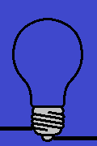

Događaji miša
-------------

U primeru "prekidač" smo pokazali kako možemo da reagujemo u programu kada korisnik pritisne taster miša. Iako korisnik posmatra klik kao jednu akciju, videli smo da je za računar to niz događaja koji počinje događajem tipa *pg.MOUSEBUTTONDOWN*.

U narednim primerima i zadacima ćemo koristiti ukupno tri tipa događaja koji nastaju upotrebom miša:

- Spuštanje bilo kog tastera miša (kao u primeru sa prekidačem), kada *dogadjaj.type* ima vrednost *pg.MOUSEBUTTONDOWN*
- Podizanje tastera miša, kada *dogadjaj.type* ima vrednost *pg.MOUSEBUTTONUP*
- Pokret miša, kada *dogadjaj.type* ima vrednost *pg.MOUSEMOTION*. Zapravo, tokom pomeranja miša generiše se više ovakvih događaja (svaki od njih opisuje neko malo pomeranje miša u nekom veoma kratkom vremenskom intervalu, tako da svaki takav događaj obično opisuje pomeranje tek za nekoliko piksela). 

Objekti - događaji čiji je tip *pg.MOUSEBUTTONDOWN* sadrže i neke dodatne podatke, kao što su:

- *dogadjaj.pos* - pozicija miša u trenutku registrovanja događaja (korišćeno u primeru sa prekidačem)
- *dogadjaj.button* - broj od 1 do 5, koji označava koje dugme miša je pritisnuto (1 - levo, 2 - srednje, 3 - desno, 4 - skrol na gore, 5 - skrol na dole)

Neki od dodatnih podataka o događaju, koje sadrže objekti - događaji tipa *pg.MOUSEMOTION* su:

- dogadjaj.pos - pozicija miša nakon događaja pomeranja miša
- dogadjaj.rel - uređeni par koji opisuje koliko se promenila pozicija miša od prethodnog događaja pomeranja miša
- dogadjaj.buttons - tročlana lista logičkih vrednosti, koje za svako od tri dugmeta miša (0 - levo, 1 - srednje, 2 - desno) određuju da li je bilo pritisnuto tokom pomeranja miša.

Obrada klika - vežbanje
'''''''''''''''''''''''

Možda niste primetili da u programu "prekidač" iz prethodne lekcije svetlo može da se uključi i isključi bilo kojim tasterom miša. To je tako jer se događaj istog tipa generiše za svaki taster miša, a mi nismo proveravali koji taster je bio pritisnut prilikom nastupanja događaja.

.. questionnote::

    **Zadatak - levi taster kao prekidač:** Iskopirajte ovde program "prekidač", a zatim ga doradite tako da se uključivanje i isključivanje sijalice može obaviti samo levim tasterom miša.

**Pomoć:** Koristite podatak *dogadjaj.button*.

.. activecode:: PyGame__interact_switch_left_button
    :nocodelens:
    :enablecopy:
    :playtask:
    :modaloutput:
    :includehsrc: src/PyGame/3_Interaction/3d_Mouse_events/Switch_left_button.py

.. questionnote::

    **Zadatak - tri prekidača:** Iskoristite delove programa "prekidač" i napravite program koji simulra rad tri prekidača, kao u primeru.

.. image:: ../../_images/Shema3_Off.png
   :width: 50px
.. image:: ../../_images/Shema3_On.png
   :width: 50px
.. image:: ../../_images/SwitchOff.png
   :width: 50px
.. image:: ../../_images/SwitchOn.png
   :width: 50px

.. image:: ../../_images/BulbOn.png
   :width: 50px

.. activecode:: PyGame__interact_switches
    :nocodelens:
    :enablecopy:
    :playtask:
    :modaloutput:
    :includehsrc: src/PyGame/3_Interaction/3d_Mouse_events/Switches.py

    import pygame as pg, pygamebg
    (sirina, visina) = (800, 500)
    prozor = pygamebg.open_window(sirina, visina, "Prekidači")

    shema_slike = (pg.image.load('Shema3_Off.png'), pg.image.load('Shema3_On.png'))
    prekidac_slike = (pg.image.load('SwitchOff.png'), pg.image.load('SwitchOn.png'))
    sijalica_slike = (pg.image.load('BulbOff.png'), pg.image.load('BulbOn.png'))
    
    ukljucen_prekidac = [False, False, False]
    prekidac_poz = [(100, 200), (300, 150), (300, 250)]
    sijalica_poz = (500, 100)
    
    # dovrsite program

Ostali događaji miša
''''''''''''''''''''

Kao što je na početku ove lekcije rečeno, u programu se može reagovati i na događaje otpuštanja tastera miša i pomeranja miša. Radi toga je potrebno uporediti vrednost *dogadjaj.type* sa konstantama *pg.MOUSEBUTTONUP* i *pg.MOUSEMOTION*. Slede zadaci u kojima možete ovo i da isprobate.

.. questionnote::

    **Zadatak - crtanje linija:** Dovršite program tako da se pomoću njega mogu crtati prave linije, kao u primeru.

.. activecode:: PyGame__interact_mouse_lines1
    :nocodelens:
    :enablecopy:
    :playtask:
    :modaloutput:
    :includehsrc: src/PyGame/3_Interaction/3d_Mouse_events/mouse_lines1.py

    import pygame as pg, pygamebg
    (sirina, visina) = (400, 400)
    prozor = pygamebg.open_window(400, 400, "Linije mišem")

    mis_poz = (0, 0)
    pocetak_linije = mis_poz
    crta_se_linija = False
    ranije_linije = []

    def nov_frejm():
        prozor.fill(pg.Color("white")) # bojimo prozor u belo
        if crta_se_linija:
            pg.draw.line(prozor, pg.Color('black'), pocetak_linije, mis_poz)
        for a, b in ranije_linije:
            pg.draw.line(prozor, pg.Color('black'), a, b)

    def obradi_dogadjaj(dogadjaj):
        global crta_se_linija, pocetak_linije, mis_poz
        
        # ovde dodajte naredbe koje rade sledece:
        
        # ako je tip dogadjaja "spustanje tastera misa":
        #     rezim crtanja linije se ukljucuje
        #     pocetak linije postavljamo na trenutnu poziciju misa
        # inace, ako je tip dogadjaja "podizanje tastera misa":
        #     rezim crtanja linije se iskljucuje
        #     nova linija je od zapamcenog pocetka linije do trenutne pozicije misa
        #     u listu prethodnih linija dodajo novu liniju 
        # inace, ako je tip dogadjaja "pomeranje misa":
        #     u promenljivoj mis_poz zapamti trenutnu poziciju misa

    pygamebg.frame_loop(30, nov_frejm, obradi_dogadjaj)

.. questionnote::

    **Zadatak - crtanje linija sa brisanjem:** Iskopirajte dole program za crtanje linija, a zatim dodajte mogućnost da se sve linije obrišu klikom na desni taster miša.

**Pomoć:** Da bismo u programu razlikovali levi i desni taster miša, ponovo treba koristiti podatak *dogadjaj.button*. Kod u funkciji *obradi_dogadjaj* sada treba da izgleda otprilike ovako:

.. activecode:: PyGame__interact_mouse_lines2_part
    :passivecode: true

        ako je tip dogadjaja  pg.MOUSEBUTTONDOWN:
            ako je pritisnuto dugme 1 (levi taster) 
                rezim crtanja linije se ukljucuje
                nova linija je od zapamcenog pocetka linije do trenutne pozicije misa
            ako je pritisnuto dugme 3 (desni taster)
                isprazni listu prethodnih linija 
        inace, ako je tip dogadjaja "podizanje tastera misa":
            ako je pritisnuto dugme 1 (levi taster)
                rezim crtanja linije se iskljucuje
                nova linija je od zapamcenog pocetka linije do trenutne pozicije misa
                u listu prethodnih linija dodajo novu liniju 
        inace, ako je tip dogadjaja "pomeranje misa":
            u promenljivoj mis_poz zapamti trenutnu poziciju misa

.. activecode:: PyGame__interact_mouse_lines2
    :nocodelens:
    :enablecopy:
    :playtask:
    :modaloutput:
    :includehsrc: src/PyGame/3_Interaction/3d_Mouse_events/mouse_lines2.py

.. questionnote::

    **Zadatak - prevlačenje:** Sledeći program pokazuje kako da korisniku našeg programa omogućimo prevlačenje objekata.
    
    Isprobajte program (prevucite jabuke u korpu) i potrudite se da ga razumete, a zatim odgovorite na pitanja ispod.

.. image:: ../../_images/apple.png
   :width: 50px
.. image:: ../../_images/basket.png
   :width: 50px
.. image:: ../../_images/drag_scene.png
   :width: 50px

.. activecode:: PyGame__interact_drag
    :nocodelens:
    :enablecopy:
    :modaloutput:
    :includesrc: src/PyGame/3_Interaction/3d_Mouse_events/drag.py

.. mchoice:: pygame__interact_quiz_drag1
   :answer_a: redni broj jabuke koju crtamo
   :answer_b: redni broj jabuke koju prevlačimo
   :answer_c: ukupan broj jabuka
   :answer_d: broj preostalih jabuka na drvetu
   :correct: b
   :feedback_a: Pokušajte ponovo
   :feedback_b: Tačno
   :feedback_c: Pokušajte ponovo
   :feedback_d: Pokušajte ponovo

   Šta predstavlja promenljiva *i_jabuka* u programu? 

.. dragndrop:: pygame__interact_quiz_drag2
    :feedback: Pokušajte ponovo!
    :match_1: if mis_je_na_slici(dogadjaj.pos, korpa_poz, korpa_slika):|||da li jabuku treba obrisati
    :match_2: if mis_je_na_slici(dogadjaj.pos, pozicije_jabuka[i]|||da li je korisnik "uzeo" jabuku
    :match_3: if len(pozicije_jabuka) == 0:|||da li je igra završena
    :match_4: if i_jabuka >= 0:|||da li je u toku prevlačenje

    Upari provere u programu sa njihovim značenjem.

.. mchoice:: pygame__interact_quiz_drag3
   :answer_a: očitavamo da li je taster miša dole tokom pomeranja
   :answer_b: prevlačenje je poseban tip događaja
   :answer_c: pri običnom pomeranju miša redni broj "jabuke koju prevlačimo" je -1
   :correct: c
   :feedback_a: To nije zgodan način, jer taster može biti pritisnut na praznom mestu (korisnik nije "uzeo" predmet koji treba da prevlači)
   :feedback_b: Ne, ne postoji takav tip događaja
   :feedback_c: Tačno

   Kako u programu razlikujemo prevlačenje od običnog pomeranja miša? 

.. commented out

    PICTURE_AS_MOUSE_CURSOR x2 - ovaj vervatno ispada jer sa novom shemom nije jasna prednost dogadjaja (svakako se crta na tik)
            
            
